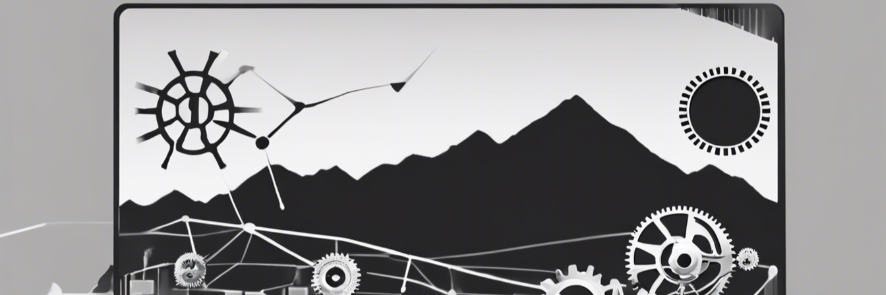

**[[Life_OS|Life OS]]** | [[Life_OS#/boot|/boot]] | [[Life_OS#/home|/home]] | [[Life_OS#/bin|/bin]] | [[Life_OS#/tmp|/tmp]]

# /boot

<!-- /boot: What you see when Life OS is first loaded. Keep this short & sweet. -->

![[ToDo#🔴 Important]]

![[ToDo#🟡 Unimportant]]

![[Quick_Notes#🗒️ Quick Notes]]

# /home

<!-- /home: Personal items. -->

## [[home/journal/Journal|📓 Journal]]

## [[Health|💓 Health]]

## [[Finance|💷 Finance]]

# /bin

<!-- /bin: Tasks are like binaries that get executed by the user. -->

## [[Tasks|📝Tasks]]

## [[Projects|📽️ Projects]]

## [[Learning|🎓 Learning]]

# /tmp

<!-- /tmp: Optional files that can be deleted if unnecessary. -->

## [[Vision_Board|💜 Vision Board]]

## [[Writings|✒️ Writings]]

## 🔗 Links

- Twitter: [adore_blvnk](https://twitter.com/adore_blvnk)
- GitHub: [adoreblvnk](https://github.com/adoreblvnk)
