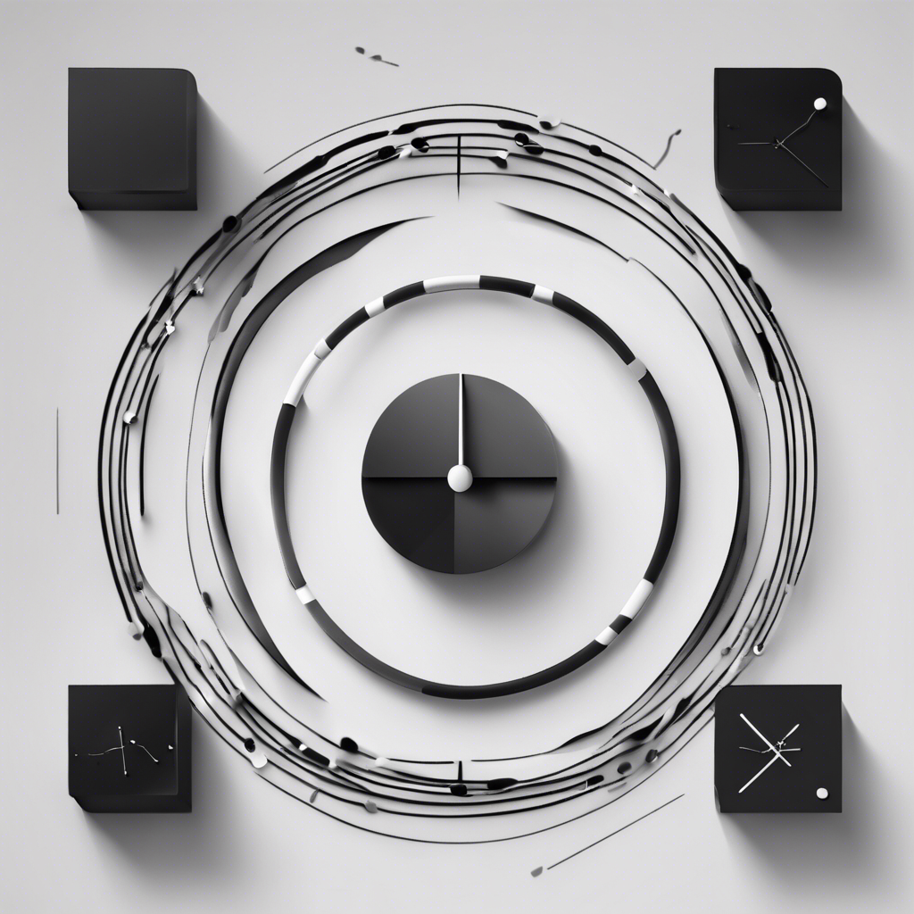

     <!-- Logo -->
    <h1>Life OS</h1> <!-- Title -->
    

      Life management system Obsidian vault template.
    
 <!-- Description -->
    

      Built With: <a href="https://obsidian.md/">Obsidian</a>
    
 <!-- Built With -->

---

Table of Contents

- [About](#about)
- [Getting Started](#getting-started)
  - [Prerequisites](#prerequisites)
  - [Installation](#installation)
- [Usage](#usage)
- [Roadmap](#roadmap)
- [License](#license)
- [Credits](#credits)

## About

Life OS management system created in Obsidian as a vault template. Linux-themed.

Version: 0.1.1

## Getting Started

### Prerequisites

- [Obsidian](https://obsidian.md/)

### Installation

- Download or clone repository. *Clone for Git sync.*
- Obsidian > Open folder as vault

## Usage

## Roadmap

- [ ] Homepage
  - [ ] Add proper banner instead of markdown image.
  - [ ] Remove properties in view.
- [ ] /boot
  - [ ] Archive tasks when done in ToDo.
- [ ] /home
  - [ ] Show past journals automatically in descending order (*DataviewJS*).
  - [ ] Improve / Scrap Health & Finance pages.
- [ ] /bin
  - [ ] Drag & drop project status (*Kanban*).
- [ ] Misc
  - [ ] Online sync (*Git & GitHub*).

## License

This project is licensed under the terms of the MIT license.

## Credits

- [adore_blvnk](https://twitter.com/adore_blvnk)
