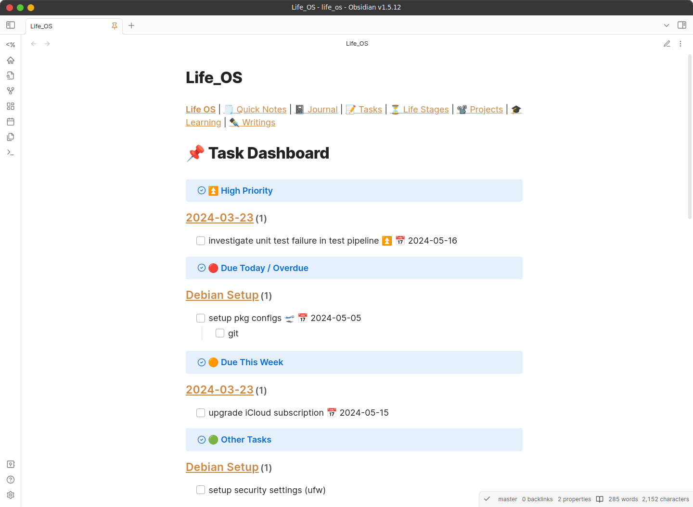
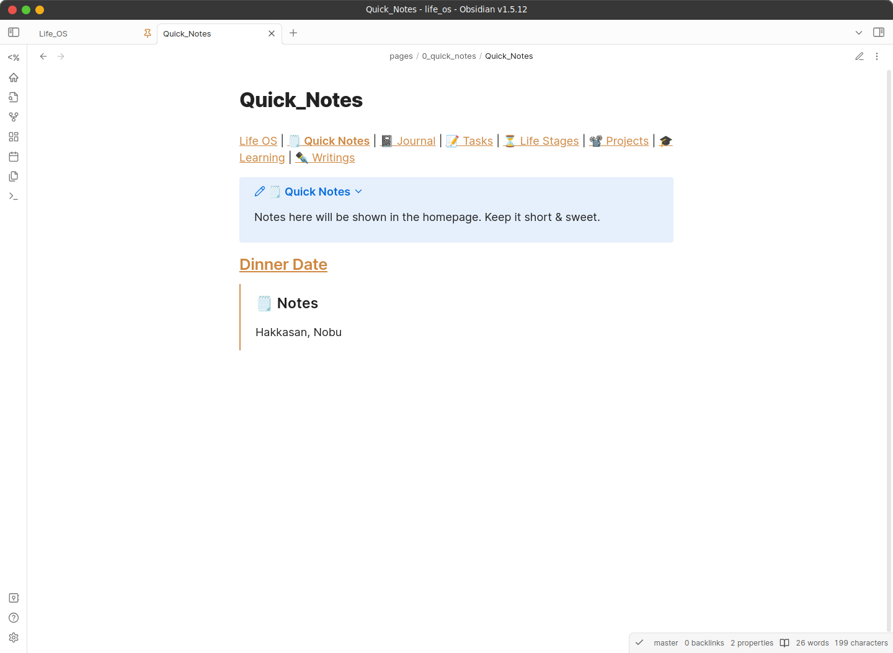
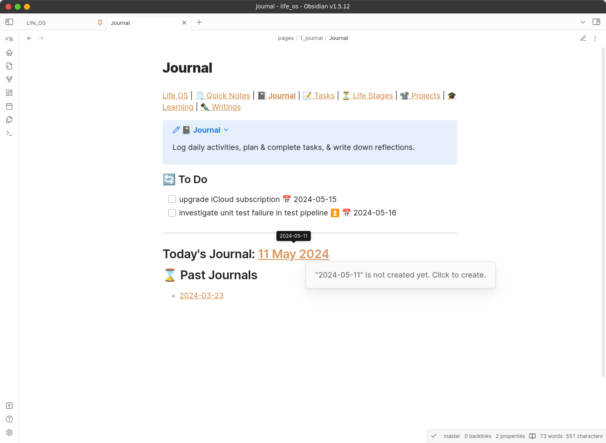
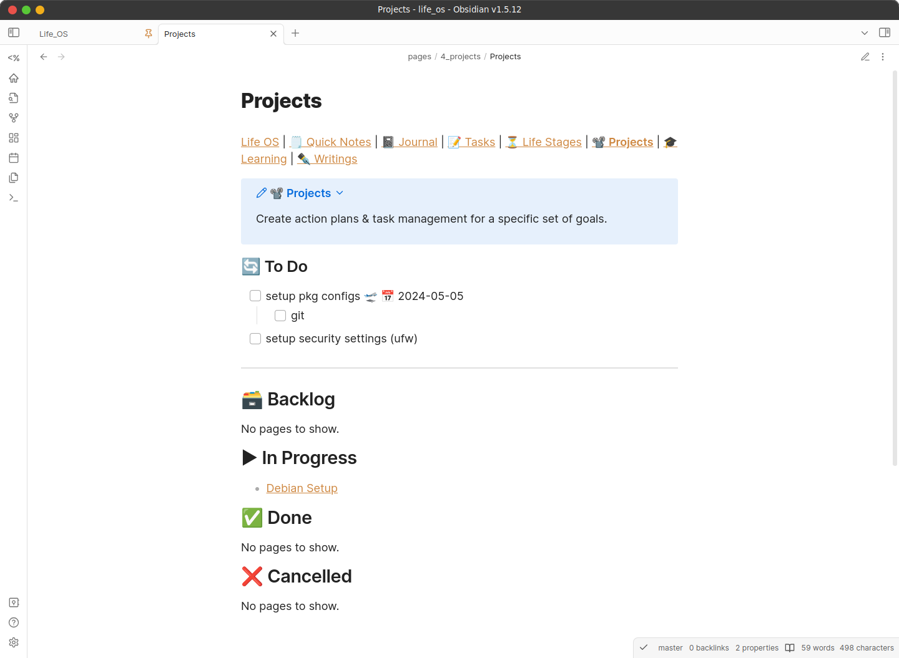
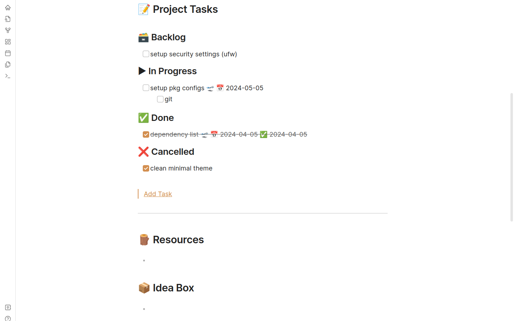
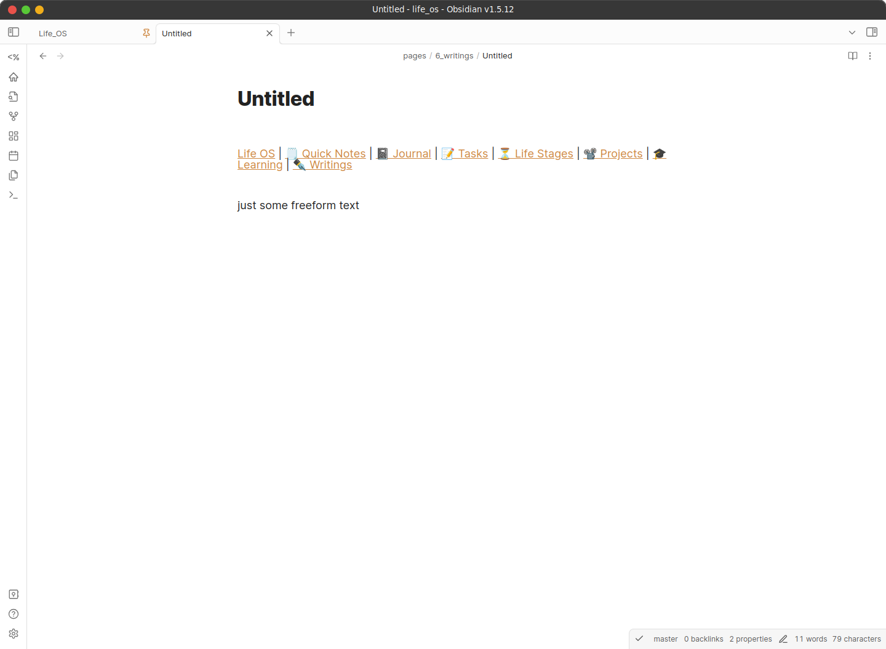

<div align="center">
   <!-- Logo -->
  <h1>Life OS</h1> <!-- Title -->
  <p>
    Life management system to organise & manage your life as an Obsidian vault.
  </p> <!-- Description -->
  <p>
    Built With: <a href="https://obsidian.md/">Obsidian</a> &bull; <a href="https://blacksmithgu.github.io/obsidian-dataview/">Dataview</a> &bull; <a href="https://github.com/saml-dev/obsidian-custom-js">CustomJS</a>
  </p> <!-- Built With -->
</div>

---

<details>
<summary>Table of Contents</summary>

- [About](#about)
- [Demo](#demo)
- [Getting Started](#getting-started)
  - [Prerequisites](#prerequisites)
  - [Installation](#installation)
- [Usage](#usage)
  - [Documentation](#documentation)
    - [Homepage](#homepage)
    - [Quick Notes](#quick-notes)
    - [Journal](#journal)
    - [Tasks](#tasks)
    - [Life Stages](#life-stages)
    - [Projects](#projects)
    - [Learning](#learning)
    - [Writings](#writings)
  - [Online sync to GitHub via Obsidian Git](#online-sync-to-github-via-obsidian-git)
    - [Linux / macOS / Windows](#linux--macos--windows)
    - [Android / iOS](#android--ios)
    - [Pushing / Pulling (Syncing)](#pushing--pulling-syncing)
  - [Bugs](#bugs)
- [Roadmap](#roadmap)
- [License](#license)
- [Credits](#credits)
</details>

## About

Life OS is a note-taking, task-setting system that helps you to organise, track, & manage your life. Life OS dashboards provides a centralised way to view your progress across different areas of your life (daily activities, life stages (long-term plans), projects).

Created in Obsidian, packaged as a Obsidian vault template.

## Demo

All demo files are stored in `data/demo` folder. To interact with the demo vault, use the script `data/demo/demo.sh`.

```bash
./data/demo/demo.sh
```

By default, the script moves demo files into the appropriate folders.

Options:

- `-u`, `--uninstall`: Uninstall (moves demo files back to demo folder) 

## Getting Started

### Prerequisites

- [Obsidian](https://obsidian.md/)

### Installation

- Download [latest release](https://github.com/adoreblvnk/life_os/releases) / Clone repository (for latest updates).
- Obsidian > Open folder as vault > Trust author and enable plugins

## Usage

### Documentation

#### Homepage

**Task Dashboard**



**Pages & Stats**


#### Quick Notes



#### Journal

**Journal Dashboard**



**Journal Page**


#### Tasks

#### Life Stages

#### Projects

**Projects Dashboard**



**Project Page**





#### Learning

#### Writings

**Writings Dashboard**


**Writings Page**



### Online sync to GitHub via [Obsidian Git](https://publish.obsidian.md/git-doc/Getting+Started#Start%20with%20existing%20remote%20repository)

Prior to this, you should've cloned / downloaded Life OS. Ensure that the `.git` folder exists.

1. [Create](https://docs.github.com/en/repositories/creating-and-managing-repositories/creating-a-new-repository#creating-a-new-repository-from-the-web-ui) your personal GitHub repository.

#### Linux / macOS / Windows

1. Follow the steps in Obsidian Git's [Authentication](https://publish.obsidian.md/git-doc/Authentication).
2. Link your GitHub repo via [changing the remote repository's URL](https://docs.github.com/en/get-started/getting-started-with-git/managing-remote-repositories#changing-a-remote-repositorys-url) or via Obsidian's Command palette *(see [Android / iOS](#android--ios))*.

#### Android / iOS

1. Create a [Personal Access Token (PAT)](https://docs.github.com/en/authentication/keeping-your-account-and-data-secure/managing-your-personal-access-tokens#creating-a-fine-grained-personal-access-token) with minimal permissions of "Read access to metadata" & "Read and Write access to administration, code, commit statuses, and pull requests".
2. In Obsidian settings, go to Community Plugins > Git > Authentication/Commit Author.
3. Enter your username, PAT, author name, & author email.
   - *NOTE: Enter your author name & author email as per your GitHub username & email.*
   - *TIP: Use GitHub's [noreply](https://docs.github.com/en/account-and-profile/setting-up-and-managing-your-personal-account-on-github/managing-email-preferences/setting-your-commit-email-address?platform=windows#about-commit-email-addresses) email address for privacy.*
4. Open Obsidian's Command palette > Git: Edit remotes > origin. Enter the URL of the GitHub repo you created.

#### Pushing / Pulling (Syncing)

1. To push local changes to remote, use Obsidian's Command palette > Git: Push.
2. *NOTE: Changes are auto pulled by default when Obsidian launches.*
  - To pull new changes from remote, use Obsidian's Command palette > Git: Pull.

### Bugs

- Javascript not rendering occasionally.
  - ```
    TypeError: Cannot read properties of undefined (reading 'file')
    ```
  - Fix: Reload DataviewJS block / close & reopen page. This occurs when Dataview fails to execute a query in time. Not a byproduct of Life OS' code.

## Roadmap

- [ ] Clean up code in `CustomUtils`.
- [ ] Implement dashboard banners for aesthetics.
- [ ] Data visualisation charts for metadata (eg done tasks).

## License

This project is licensed under the terms of the MIT license.

## Credits

- [adore_blvnk](https://twitter.com/adore_blvnk)

## Acknowledgements  <!-- omit in toc -->

- [Obsidian Tasks](https://github.com/obsidian-tasks-group/obsidian-tasks)
- [Templater](https://github.com/SilentVoid13/Templater)
- [Homepage](https://github.com/mirnovov/obsidian-homepage)
- [Set View Mode per Note](https://github.com/AlexDavies8/obsidian-frontmatter-viewmode)
- [Emoji Toolbar](https://github.com/oliveryh/obsidian-emoji-toolbar)
- [Obsidian Git](https://github.com/denolehov/obsidian-git)
