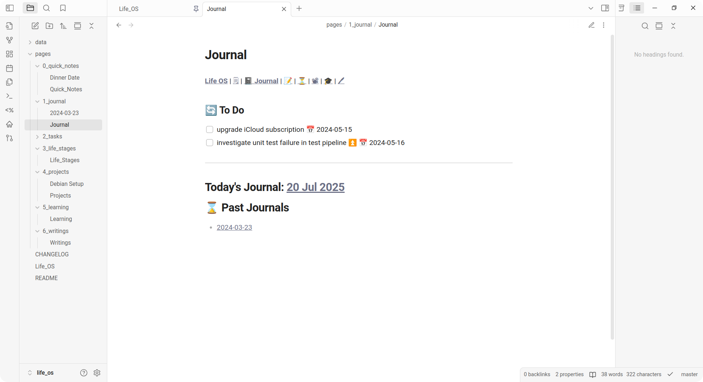
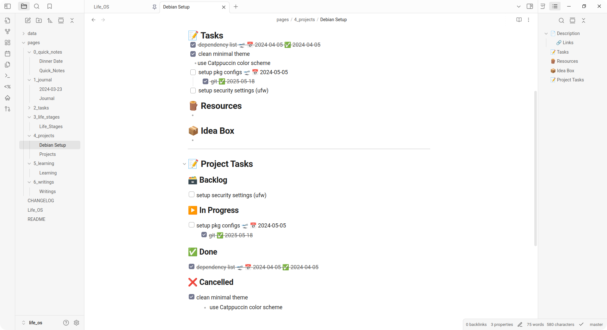
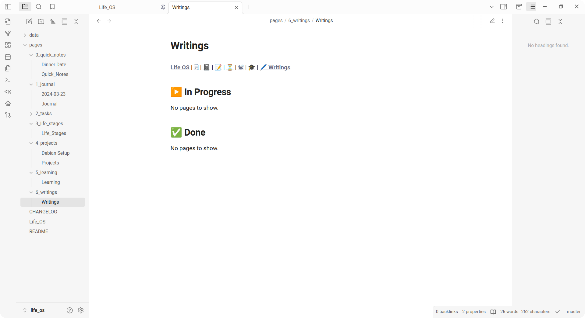

 <!-- use align as CSS is not allowed on GitHub markdown https://github.com/orgs/community/discussions/22728 -->
   <!-- Logo -->
  <h1>Life OS</h1> <!-- Project Name -->
  
 <!-- Description -->
    Life management system to organize & manage your life as an Obsidian vault.
  

  
 <!-- Built With -->
    Built With: <a href="https://obsidian.md">Obsidian</a> &bull; <a href="https://blacksmithgu.github.io/obsidian-dataview">Dataview</a> &bull; <a href="https://github.com/saml-dev/obsidian-custom-js">CustomJS</a>
  

---

Table of Contents

- [About](#about)
- [Demo](#demo)
- [Getting Started](#getting-started)
  - [Prerequisites](#prerequisites)
  - [Installation](#installation)
    - [Universal](#universal)
- [Usage](#usage)
  - [Documentation](#documentation)
    - [Homepage](#homepage)
    - [Quick Notes](#quick-notes)
    - [Journal](#journal)
    - [Tasks / Life Stages / Projects / Learning](#tasks--life-stages--projects--learning)
    - [Writings](#writings)
  - [Tips](#tips)
- [Changelog](#changelog)

## About

Life OS is a note-taking, task-setting system that helps you to organise, track, & manage your life. Life OS dashboards provides a centralised way to view your progress across different areas of your life (daily activities, life stages (long-term plans), projects).

Created in Obsidian, packaged as a Obsidian vault template.

## Demo

## Getting Started

### Prerequisites

Install [Obsidian](https://obsidian.md).

### Installation

#### Universal

This installation works on all platforms (eg Windows, macOS, Linux, Android, iOS).

1. [Fork this repo](https://github.com/adoreblvnk/life_os/fork) on GitHub.
   - _NOTE: If you would like to make your vault private, go to your repository Settings > Change repository visibility, & select "Change to private"._
2. [Create a PAT](https://github.com/settings/personal-access-tokens/new) on GitHub with minimal permissions as the following & save it:
   - Contents: Read & write
   - Metadata: Read-only
3. In Obsidian, create a new vault in your desired location.
4. Install [Obsidian Git Plugin](https://github.com/Vinzent03/obsidian-git).
   1. Open **Settings**
   2. In **Community plugins**, select **Turn on community plugins**
   3. Select **Browse** & search for "Git"
   4. Install & enable the Git plugin
5. Configuring your credentials
   1. Open **Settings**
   2. In **Git**, under **Authentication**, type your username & PAT that you generated
6. Cloning your vault
   1. In [Command palette](https://help.obsidian.md/plugins/command-palette) (press <kbd>Ctrl</kbd>+<kbd>P</kbd>), type "Clone an existing remote repo" & press <kbd>Enter</kbd>.
   2. Paste your GitHub repo URL as the remote
   3. Enter <kbd>.</kbd> / Select **Vault root** when asked to "Enter directory for clone"
   4. Select **YES** when asked "Does your remote repo contain a .obsidian directory at root:
   5. Select **DELETE ALL YOUR LOCAL CONFIG AND PLUGINS** when asked "To avoid conflicts"
   6. Press <kbd>Enter</kbd>
   7. Reload Obsidian
7. Configuring Git username & email.
   1. Open **Settings**
   2. In **Git**, under **Authentication**, set your GitHub username & [email](https://docs.github.com/en/account-and-profile/setting-up-and-managing-your-personal-account-on-github/managing-email-preferences/setting-your-commit-email-address)
8. Set your personal branch as upstream in Command Palette:
   1. Select **Create new branch** & type "personal"
   2. Select **Switch branch** & select "personal"
   3. Select **Set upstream branch** & select **origin**
   4. When prompted to "Select or create a new remote branch", type "origin/personal"
9. In your GitHub repo [settings](https://github.com/adoreblvnk/life_os_personal/settings), select **Default branch** & select **personal**.

<!-- #### Linux Script -->

## Usage

### Documentation

#### Homepage

Your central command center that aggregates tasks, quick notes, and key metrics. The dashboard provides an at-a-glance view of your productivity and upcoming tasks, with quick access to all major sections of Life OS through the navigation bar

Quick Notes embeds the most recently modified note on the homepage as well.

#### Quick Notes

Capture thoughts, ideas, and temporary information instantly. This digital scratchpad ensures no inspiration is lost, with the most recent note always visible on your homepage for quick reference.

#### Journal

Your personal daily companion for tracking tasks, thoughts, and progress. Each journal entry provides a clean, focused space for daily planning and reflection, with intuitive navigation between past and future entries.

Quickly jump between days using the navigation links, and keep track of your daily tasks all in one place.

#### Tasks / Life Stages / Projects / Learning

The To Do section lists all uncompleted tasks across all projects sorted by recency.

Next, projects are sorted according to their status. To modify a page status, edit the frontmatter yaml via "Properties view: Show file properties" via Command palette from the project page.

For Projects, a pseudo [Kanban Board](https://www.atlassian.com/agile/kanban/boards) style is adopted, hence pages have 4 statuses:

- **Backlog**: For projects not yet started
- **In Progress**: For projects started
- **Done**: For completed projects
- **Cancelled**: For projects formerly "In Progress" but ultimately did not complete

_NOTE: If you have come here from other page types, note that other page types may have **different** page statuses, hence this is a non-exhaustive list of page statuses, but the overall structure remains similar._

Within the Description section, note that the timebox starting date is automatically filled up.

The Project Tasks section is a mini dashboard of all project tasks. Add tasks via the "Add Task" navlink, where "Add Task" is located at the bottom of the page.

Task statuses, what they mean, & how to add them:

- **Backlog**: Normal task with text
- **In Progress**: [optional] Tasks with a start date symbol (🛫)
- **Done**: Tasks completed (Markdown `- [x]`)
- **Cancelled**: Tasks with hyphen symbol between task list square brackets (Markdown `- [-]`)

Adding emojis is easiest done with Tasks' [auto-suggest menu](https://publish.obsidian.md/tasks/Editing/Auto-Suggest) already included. Life OS only uses start date (🛫), high priority (⏫), & done (✅) (enabled by default when a task is completed).

_NOTE: Do **NOT** confuse task status with project status._

#### Writings

A clean, distraction-free space for your long-form content. The minimalist design puts the focus on your writing, with a simple navigation bar for easy access to other sections of your Life OS.

### Tips

1. Put your images in `img/` to separate your media from your notes.

## Changelog

See [CHANGELOG](CHANGELOG.md) for details.

## License <!-- omit in toc -->

Distributed under the MIT License.

## Credits <!-- omit in toc -->

- [adore_blvnk](https://x.com/adore_blvnk)

## Acknowledgements <!-- omit in toc -->

- [Obsidian Tasks](https://github.com/obsidian-tasks-group/obsidian-tasks)
- [Templater](https://github.com/SilentVoid13/Templater)
- [Homepage](https://github.com/mirnovov/obsidian-homepage)
- [Set View Mode per Note](https://github.com/AlexDavies8/obsidian-frontmatter-viewmode)
- [Emoji Toolbar](https://github.com/oliveryh/obsidian-emoji-toolbar)
- [Obsidian Git](https://github.com/denolehov/obsidian-git)
